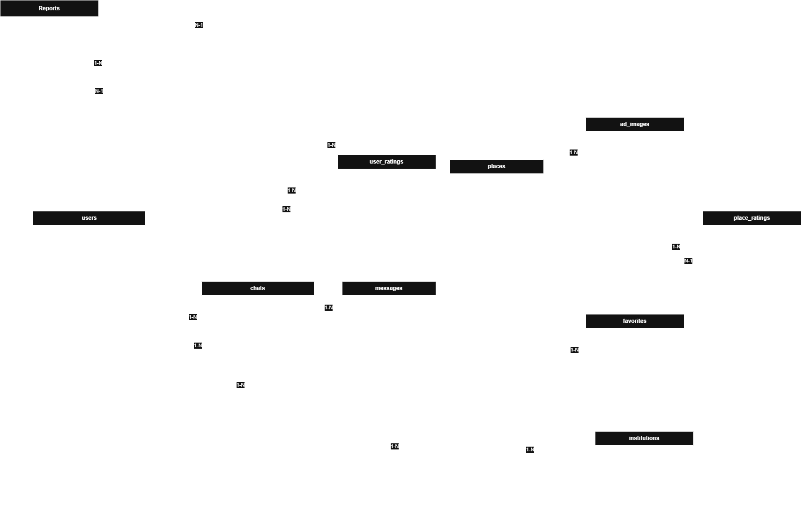

# Lar Universitario

## Problema: 

Encontrar moradias proximas de universidades, onde o principal meio de encontrar sendo grupos do facebook e imobiliarias, mas com poucos lugares próprios para estudantes tanto devido ao tamanho do lugar, quanto pela distância da universidade.

## Requisitos

### Atores
* Usuario
	*  Tipo de Usuário, sendo os possiveis
		*  Estudante
		*  Proprietário
		*  Locador
		*  República
	* Criar conta
	* Buscar imóveis
	* Favoritar anúncios
	* Avaliar imóveis
	* Avaliar locadores

* Administrador
	* Gerenciar usuários
	*  Validar anúncios
	*  Remover conteúdo inadequado
	*  Verificar denúncias
		
### Requisitos funcionais

*  ### RF01 -  Cadastro e Login de Usuarios
	* Usuario deve conseguir criar sua conta, usando:
		* Email
		* Senha
		* Nome de usuario

* ###  RF02 - Perfil do Usuário
   * O usuário deve conseguir customizar  sua  conta podendo customizar:
		* Nome
		* Universidade / Locador
		* Foto de  Perfil
		* Descrição do perfil

 * ### RF03 - Cadastro de anúncios
	* Todos os usuários devem conseguir criar anúncios para moradias proximas de universidades, tanto locadores quanto outros alunos, durante a criação de um anúncio deve ser inserido:
  
		* Brief do local
		* Universidade mais proxima
		* Distancia da universidade mais proxima
		* Se  imóvel é imobiliado ou não
		* tipo de imóvel , sendo eles:
			*  Apartamento
			*  Quarto
			*  Vaga em Quarto
			*  República
		* tamanho do imóvel
		* Quantidade de cômodos
		* Valor mensal
		* Fotos do imóvel

* ### RF04 - Catálogo de imóveis

	* É necessario um catálogo de imóveis para exibir os imóveis de acordo com os parâmetros de pesquisa do usuário, priorizando proximidade  com o lugar desejado.
 
* ###  RF05 - Filtros no catálogo
	* O Catálogo deve ter filtros, para melhor pesquisa de moradias, sendo os filtros desejados:
	  * Universidade
	  * Cidade
	  * bairro
	  * Mobiliado
	  * Avaliação
	  * Recentes
* ###  RF06 - Avaliação de Locadores
  
	* Deve ser possivel avaliar locadores, tanto pelo serviço para a locação do imóvel quanto pelo imóvel em si.
 
* ### RF07 - Verificação de anúncios
  * Os anúncios serão postados e terá como base a Moderação reativa, onde o anúncio:
  	1. Irá ao ar automáticamente 
	2. Caso o anúncio contenha informações falsas, conteúdo inadequado ou suspeita de fraude, qualquer usuário poderá reportá-lo conforme a RF09.
	3. Admnistrador reagira à denuncia 

* ### RF08 - Favoritar anúncios
	*  Usuarios devem conseguir favoritar anúncios e visualiza-los em uma aba dedicada.
 
* ### RF09 - Reportar anúncios
	*  Usuarios devem conseguir reportar anúncios e tais devem ser redirecionados para o admnistrador do sistema.

 * ### RF10 -  Chat em tempo real entre locador e locatário
	*  Deve ser possivel que o locatário e o locador possam conversar dentre si, sendo possivel o compartilhamento de imagens.

* ### RN11 - Avaliações devem ter nota de 0 a 5
	* Toda avaliação de imóvel ou usuário deve possuir uma nota entre 0 e 5.

* ### RN12 - Anúncios removidos ou bloqueados não devem aparecer no catálogo
	* Apenas anúncios com status ativo devem aparecer nas buscas públicas.

* ### RN13 - Apenas usuários autenticados podem favoritar, avaliar, denunciar e abrir chat
 	* Usuários não autenticados podem apenas buscar e visualizar anúncios.

### Requisitos não funcionais

* ### RNF01 - Segurança
	* As senhas devem ser armazenadas utilizando um hash seguro.
 * ### RNF02 - Responsividade
	* O sistema deve funcionar em todos os dispositivos com telas maiores de 320px.
 * ### RNF03 - Disponibilidade
	* O sistema deve estar disponivel 99% do tempo.
* ### RNF04 - Desempenho
	* As buscas devem retornar resultados em até 3 segundos para até 10k de anúncios cadastrados.
* ### RNF05 - Usabilidade
	* O sistema deve permitir que o usuário encontre anúncios próximos a uma 		universidade com no máximo três interações principais: pesquisar, filtrar e visualizar anúncio.
 

### Regras de negócio

* ### RN01 - Única criação de conta por email
	* deve haver apenas uma conta por email registrado.

* ### RN02 - Único username durante criação de conta
	* Usernames devem ser únicos para melhor identificação de contas.

* ### RN03 - Report único por usuario
	* Um usuário só pode reportar o mesmo anúncio uma vez.

* ### RN04 - Auto-Report impossbilitado
	* Um usuário não pode se auto-reportar.

* ### RN05 - Um chat por interessado, lugar
	* Um interessado pode ter apenas um chat por lugar.

* ### RN06 - Auto-avaliação impossibilitada
	* Um usuario não pode se auto-avaliar.

* ### RN07 - Chat somente com o dono do lugar
	* Todo o chat deve ser de 1 para 1 apenas com o dono do local.

* ### RN08 - Restrição ao favoritar duplamente
	* Um usuário só pode favoritar um lugar apenas uma vez, não mais de uma.

* ### RN09 - Apenas o criador do anúncio pode editar 
	* Apenas o criador do anúncio pode editar o mesmo.

* ### RN10 - Sem auto-chatting
	* Criador do anúncio não deve conseguir abrir um chat consigo mesmo.

* ### RN11 - Avaliações devem ter nota de 0-5
	* Todas as devem ter uma nota de 0 à 5.

* ### RN12 - Funcionamento do report
	* Um report deve ter place_id OU reported_user_id, mas não ambos obrigatoriamente.

## Modelos e Diagramas
 ### Diagrama de entidades e relacionamentos
 

 ### Diagrama de caso de uso
 
 