# Lar Universitario

## Problema:

Encontrar moradias próximas de universidades, onde o principal meio de encontrar sendo grupos do facebook e imobiliárias, mas com poucos lugares próprios para estudantes, tanto devido ao tamanho do lugar, quanto pela distância da universidade.

## Requisitos

### Atores
* Usuário
    *  Tipo de Usuário, sendo os possíveis
        *  Estudante
        *  Proprietário
        *  Locador
        *  República
    * Criar conta
    * Buscar imóveis
    * Favoritar anúncios
    * Avaliar imóveis
    * Avaliar locadores

* Administrador
    * Gerenciar usuários
    *  Validar anúncios
    *  Remover conteúdo inadequado
    *  Verificar denúncias
       
### Requisitos funcionais

*  ### RF01 -  Cadastro e Login de Usuários
    * Usuário deve conseguir criar sua conta, usando:
        * Email
        * Senha
        * Nome de usuário

* ###  RF02 - Perfil do Usuário
   * O usuário deve conseguir customizar  sua  conta podendo customizar:
        * Nome
        * Universidade / Locador
        * Foto de  Perfil
        * Descrição do perfil

 * ### RF03 - Cadastro de anúncios
    * Todos os usuários devem conseguir criar anúncios para moradias próximas de universidades, tanto locadores quanto outros alunos, durante a criação de um anúncio deve ser inserido:
 
        * Brief do local
        * Universidade mais próxima
        * Distancia da universidade mais próxima
        * Se  imóvel é mobiliado ou não
        * tipo de imóvel , sendo eles:
            *  Apartamento
            *  Quarto
            *  Vaga em Quarto
            *  República
        * tamanho do imóvel
        * Quantidade de cômodos
        * Valor mensal
        * Fotos do imóvel

* ### RF04 - Catálogo de imóveis

    * É necessário um catálogo de imóveis para exibir os imóveis de acordo com os parâmetros de pesquisa do usuário, priorizando proximidade  com o lugar desejado.
 
* ###  RF05 - Filtros no catálogo
    * O Catálogo deve ter filtros, para melhor pesquisa de moradias, sendo os filtros desejados:
      * Universidade
      * Cidade
      * bairro
      * Mobiliado
      * Avaliação
      * Recentes
* ###  RF06 - Avaliação de Locadores
 
    * Deve ser possível avaliar locadores, tanto pelo serviço para a locação do imóvel quanto pelo imóvel em si.
 
* ### RF07 - Verificação de anúncios
  * Os anúncios serão postados e terá como base a Moderação reativa, onde o anúncio:
    1. Irá ao ar automáticamente
    2. Caso o anúncio contenha informações falsas, conteúdo inadequado ou suspeita de fraude, qualquer usuário poderá reportá-lo conforme a RF09.
    3. Administrador reagirá à denúncia

* ### RF08 - Favoritar anúncios
    *  Usuários devem conseguir favoritar anúncios e visualizá-los em uma aba dedicada.
 
* ### RF09 - Reportar anúncios
    *  Usuários devem conseguir reportar anúncios e tais devem ser redirecionados para o administrador do sistema.

 * ### RF10 -  Chat em tempo real entre locador e locatário
    *  Deve ser possível que o locatário e o locador possam conversar entre si, sendo possível o compartilhamento de imagens.

### Requisitos não funcionais

* ### RNF01 - Segurança
    * As senhas devem ser armazenadas utilizando um hash seguro.

 * ### RNF02 - Responsividade
    * O sistema deve funcionar em todos os dispositivos com telas maiores que 320px.

 * ### RNF03 - Disponibilidade
    * O sistema deve estar disponível 99% do tempo.

* ### RNF04 - Desempenho
    * As buscas devem retornar resultados em até 3 segundos para até 10k de anúncios cadastrados.

* ### RNF05 - Usabilidade
    * O sistema deve permitir que o usuário encontre anúncios próximos a uma        universidade com no máximo três interações principais: pesquisar, filtrar e visualizar anúncio.
 

### Regras de negócio

* ### RN01 - Única criação de conta por email
    * deve haver apenas uma conta por email registrado.

* ### RN02 - Único username durante criação de conta
    * Usernames devem ser únicos para melhor identificação de contas.

* ### RN03 - Report único por usuário
    * Um usuário só pode reportar o mesmo anúncio uma vez.

* ### RN04 - Auto-Report impossibilitado
    * Um usuário não pode se auto-reportar.

* ### RN05 - Um chat por interessado, lugar
    * Um interessado pode ter apenas um chat por lugar.

* ### RN06 - Auto-avaliação impossibilitada
    * Um usuário não pode se auto-avaliar.

* ### RN07 - Chat somente com o dono do lugar
    * Todo o chat deve ser de 1 para 1 apenas com o dono do local.

* ### RN08 - Restrição ao favoritar duplamente
    * Um usuário só pode favoritar um lugar apenas uma vez, não mais de uma.

* ### RN09 - Apenas o criador do anúncio pode editar
    * Apenas o criador do anúncio pode editar o mesmo.

* ### RN10 - Sem auto-chatting
    * Criador do anúncio não deve conseguir abrir um chat consigo mesmo.

* ### RN11 - Avaliações devem ter nota de 0-5
    * Todas as devem ter uma nota de 0 à 5.

* ### RN12 - Funcionamento do report
    * Um report deve ter place_id OU reported_user_id, mas não ambos obrigatoriamente.

* ### RN13 - Anúncios removidos ou bloqueados não devem aparecer no catálogo
    * Apenas anúncios com status ativo devem aparecer nas buscas públicas.

* ### RN14 - Apenas usuários autenticados podem favoritar, avaliar, denunciar e abrir chat
    * Usuários não autenticados podem apenas buscar e visualizar anúncios.

## Modelos e Diagramas
 ### Diagrama de entidades e relacionamentos
 

 ### Diagrama de caso de uso
 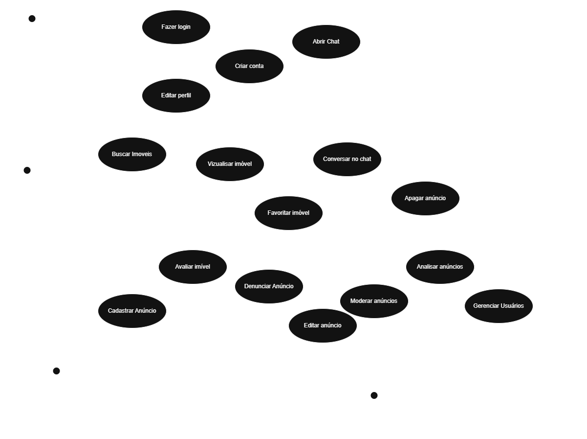
 
# Páginas e prototipação

## Levantamento de páginas necessárias

Com base nos requisitos funcionais do sistema **Lar Universitário**, foram identificadas as principais páginas necessárias para atender aos usuários estudantes, proprietários, locadores, repúblicas e administradores.

As páginas foram categorizadas em três grupos principais:

* **Páginas Públicas**: páginas acessíveis por qualquer usuário, mesmo sem estar autenticado.
* **Páginas Visíveis Quando Cadastrado**: páginas ou funcionalidades disponíveis apenas para usuários autenticados.
* **Páginas Privadas**: Páginas relacionadas à gestão da conta, anúncios e informações pessoais do usuário.

## Páginas Públicas

### Landing Page

A página de landing page serve principalmente para a conversão de usuários para o sistema, sendo o principal meio de captura de usuários para a plataforma. Ela apresentará locações próximas às principais universidades.

Cada card das locações apresentará tais informações relevantes:

* Universidade proxima
* Preço mensal
* Tipo de imovel
* Mobiliado ou não
* Imagens da locação

### Catálogo de Locações

Página onde serão listadas inicialmente as principais locações próximas às principais universidades. Contará com uma search box para que o usuário possa pesquisar imóveis e aplicar filtros de acordo com o RF05.

Os anúncios serão exibidos em formato de cards organizados em grid, facilitando a visualização das opções disponíveis.

Cada card das locações apresentará tais informações relevantes:

* Universidade proxima
* Preço mensal
* Tipo de imovel
* Mobiliado ou não
* Imagens da locação

### Página de Login 

Esta página servirá para login e cadastro do usuário, com as duas funções integradas na mesma tela. Terá um layout simples, contendo os inputs necessários  fazer login no sistema, também apresentará um hyperlink para fazer recuperação de senha

### Página de Cadastro 

Página semelhante à página de login, requirindo os dados necessarios para o registro, sendo eles:

* Nome de usuário
* Email
* Senha
* Confirmar Senha

### Página de Visualização de Anúncio

Página na qual serão exibidos os dados da locação, descrição do anúncio, imagens, localização da propriedade pelo mapa, universidade próxima e informações gerais do imóvel.

Usuários não autenticados poderão visualizar os dados públicos do anúncio, enquanto usuários autenticados terão acesso a ações adicionais, como favoritar, avaliar, denunciar e iniciar chat com o locador.

### Página de Perfil Público

Página que exibirá os anúncios do usuário, suas avaliações e informações públicas do perfil. Também poderá conter um botão para reportar o perfil do usuário, caso o visitante esteja autenticado.

### Esqueci minha senha

Página para recuperação de senha, onde requererá o email do usuario, e após isso, um código para fazer a recuperação da senha

## Páginas Visíveis Quando Cadastrado

### Página de Criação de Anúncio

Esta página servirá como área para criação de anúncios. Será uma página sem scroll, com a passagem entre etapas ocorrendo através de um botão de próximo.

Nela, o usuário que deseja alugar uma propriedade poderá inserir todos os dados necessários para a criação de um anúncio, como descrição, tipo de imóvel, valor mensal, fotos, distância da universidade e demais informações obrigatórias.

### Página de Chat

Página simples, com uma sidebar contendo os chats ativos do usuário. Ao selecionar um chat, será exibida uma área maior à direita com as mensagens da conversa.

O chat terá um header indicando o anúncio ao qual a conversa está relacionada, permitindo a comunicação direta entre locador e interessado.

### Página de Report

Será um pop-up que aparecerá sobre o anúncio ou perfil ao apertar no botão de denunciar. O modal contará com um input para descrever o motivo da denúncia e um dropdown menu com categorias de denúncia.

### Pop-up de Avaliação

Ao apertar no botão para avaliar o local ou locador, será exibido um modal com 5 estrelas vazias. O usuário poderá selecionar a quantidade de estrelas correspondente à nota desejada e inserir um comentário sobre o imóvel ou serviço prestado.

### Página de Favoritos

Página que exibirá uma lista com os anúncios favoritados pelo usuário. Anúncios inativos não deverão ser exibidos, facilitando a localização dos imóveis salvos e disponíveis.

## Páginas Privadas

### Página de Edição de Anúncio

Página que permitirá ao criador do anúncio alterar imagens, descrição e outros dados relacionados ao imóvel anunciado.

Apenas o usuário que criou o anúncio poderá editar suas informações.

### Página de Edição de Perfil

Página onde será possível alterar os dados do perfil do usuário, como foto de perfil, apelido, tipo de usuário, universidade, descrição e demais informações pessoais exibidas no sistema.

### Meus Anúncios

Página que listará todos os anúncios criados pelo usuário. Cada card de anúncio terá opções para editar ou apagar o anúncio.

### Página de Avaliações Recebidas

Página onde o usuário poderá visualizar uma lista das avaliações recebidas, mostrando o nome do avaliador, a nota atribuída e o comentário feito pelo usuário avaliador.

Essa página permite que locadores, proprietários, estudantes ou repúblicas acompanhem sua reputação dentro da plataforma.

## Páginas administrativas

### Denúncias

Página onde serão listadas todas as denúncias feitas na plataforma, permitindo que o administrador visualize, analise e tome ações sobre os conteúdos ou usuários reportados.

A página possibilitará filtrar e classificar as denúncias por:

* Data de criação
* Status da denúncia

Também haverá uma área de pesquisa para inserir dados e buscar denúncias específicas dentro da plataforma.

Cada denúncia deverá exibir informações relevantes, como:

* Usuário que realizou a denúncia
* Anúncio ou usuário denunciado
* Motivo da denúncia
* Categoria da denúncia
* Data de criação
* Status atual
* Ações disponíveis para o administrador

### Gerenciamento de Anúncios

Página onde serão listados todos os anúncios cadastrados na plataforma, permitindo que o administrador visualize, pesquise, filtre e gerencie os anúncios existentes.

A página possibilitará filtrar e classificar os anúncios por:

* Data de criação
* Status do anúncio
* Universidade próxima
* Cidade
* Tipo de imóvel
* Usuário criador

Também haverá uma área de pesquisa para buscar anúncios específicos por informações como título, descrição, localização, nome do anunciante ou universidade.

Cada anúncio deverá exibir informações relevantes, como:

* Título do anúncio
* Usuário criador
* Tipo de imóvel
* Universidade próxima
* Valor mensal
* Status atual
* Data de criação
* Ações disponíveis para o administrador

As ações possíveis para o administrador incluem:

* Visualizar detalhes do anúncio
* Editar informações do anúncio, caso necessário
* Remover anúncio
* Bloquear anúncio
* Reativar anúncio
* Visualizar denúncias relacionadas ao anúncio

### Gerenciamento de Usuários

Página onde serão listados todos os usuários cadastrados na plataforma, permitindo que o administrador visualize, pesquise, filtre e gerencie os usuários existentes.

A página possibilitará filtrar e classificar os usuários por:

* Data de criação
* Tipo de usuário
* Status da conta
* Quantidade de anúncios publicados
* Quantidade de denúncias recebidas

Também haverá uma área de pesquisa para buscar usuários específicos por informações como nome, e-mail, nome de usuário ou tipo de usuário.

Cada usuário deverá exibir informações relevantes, como:

* Nome do usuário
* E-mail
* Nome de usuário
* Tipo de usuário
* Status da conta
* Data de criação
* Quantidade de anúncios publicados
* Quantidade de denúncias recebidas
* Ações disponíveis para o administrador

As ações possíveis para o administrador incluem:

* Visualizar perfil do usuário
* Visualizar anúncios do usuário
* Visualizar denúncias relacionadas ao usuário
* Bloquear usuário
* Banir usuário
* Reativar usuário
* Remover conteúdo inadequado relacionado ao usuário

# Prototipação de Páginas

### Progresso

**Páginas comuns**

[X] Landing Page 
[X] Catálogo de Locações 
[X] Página de Login + Cadastro 
[X] Página de Visualização de Anúncio 
[X] Página de Perfil Público 
[X] Esqueci minha senha

**Páginas Visíveis Quando Cadastrado**

[X] Página de Criação de Anúncio 
[X] Página de Chat 
[X] Página de Report 
[X] Pop-up de Avaliação 
[X] Página de Favoritos 
[X] Página de Edição de Anúncio 
[ ] Página de Edição de Perfil 
[X] Meus Anúncios 
[X] Página de Avaliações Recebidas

**Páginas administrativas**

[ ] Denúncias 
[ ] Gerenciamento de Anúncios 
[ ] Gerenciamento de Usuários

## Páginas comuns

 ### Landing Page

 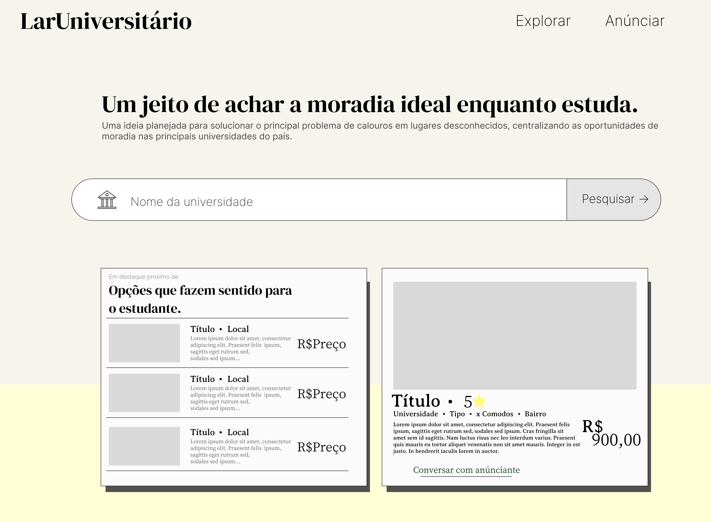

 ### Catálogo de Locações
 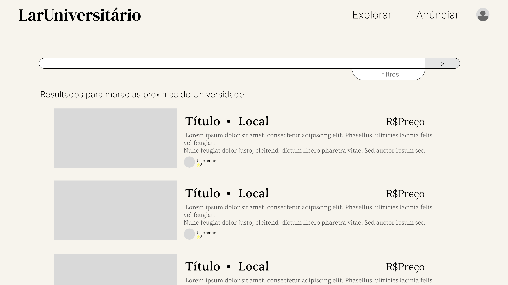

 ### Login

 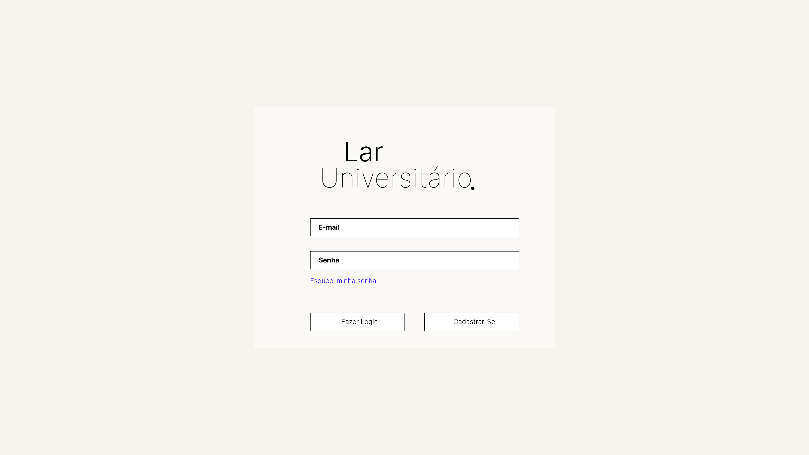

  ### SignUp Page

 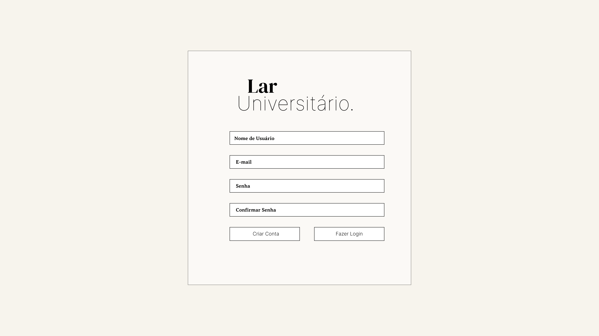

   ### Ad View Page

 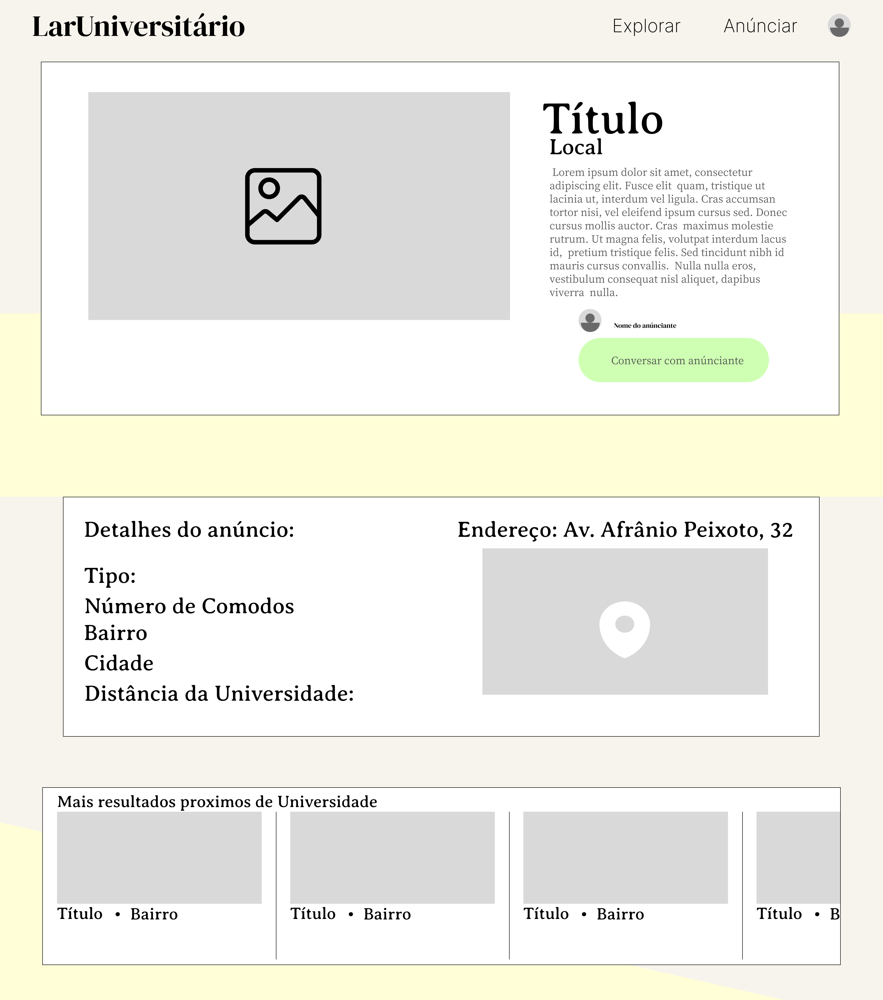

   ### Ad View Page

 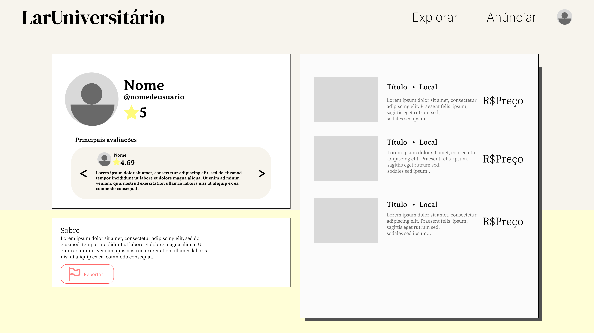

   ### Forgoten pass

 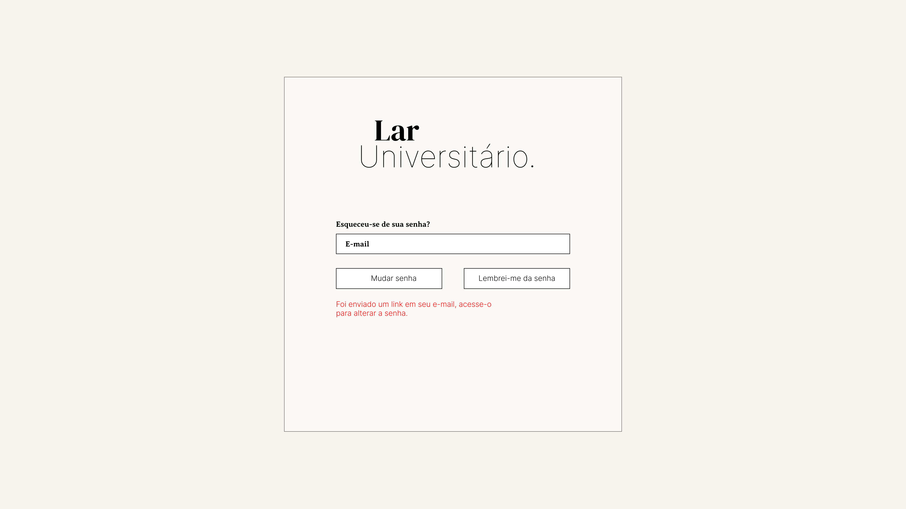

## Páginas Visíveis Quando Cadastrado

   ### Ad Creation

 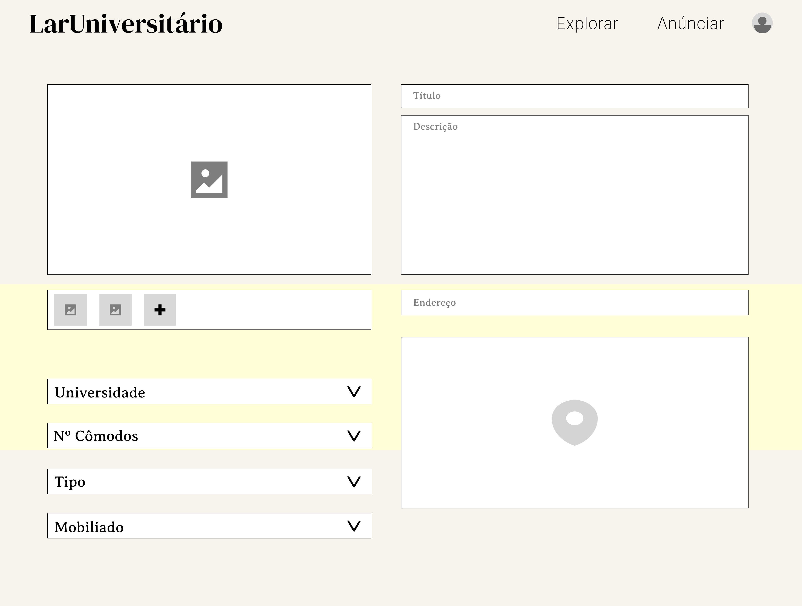

 ### Chat Page

 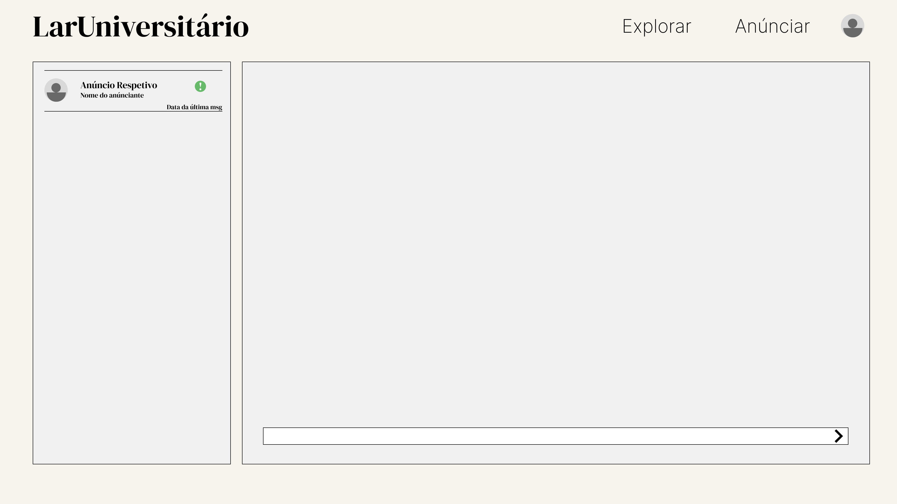

  ### Report User Page

 

  ### Report User Page

 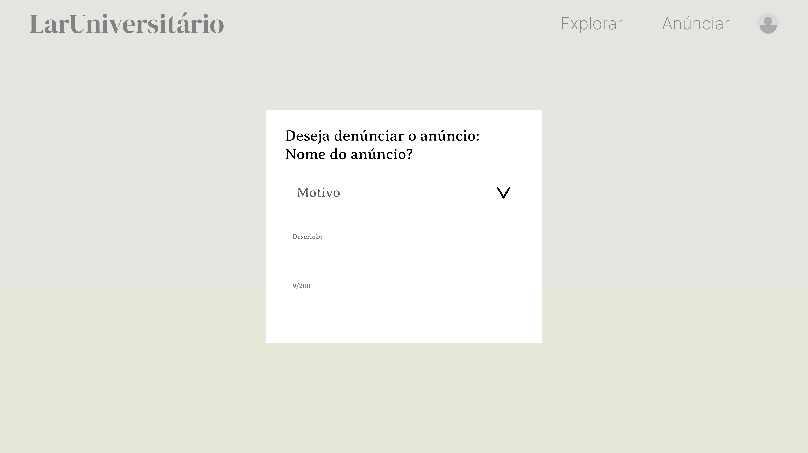

  ### Rate Pop Up

 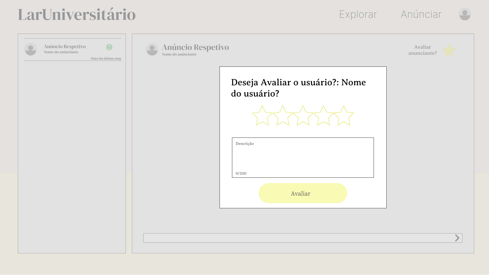

   ### Favourite list Page

 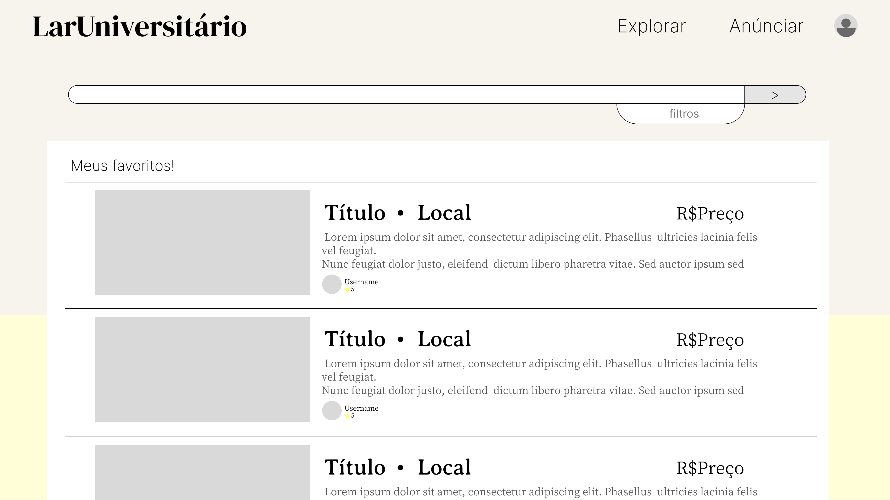

 ### Ad Edit Page

 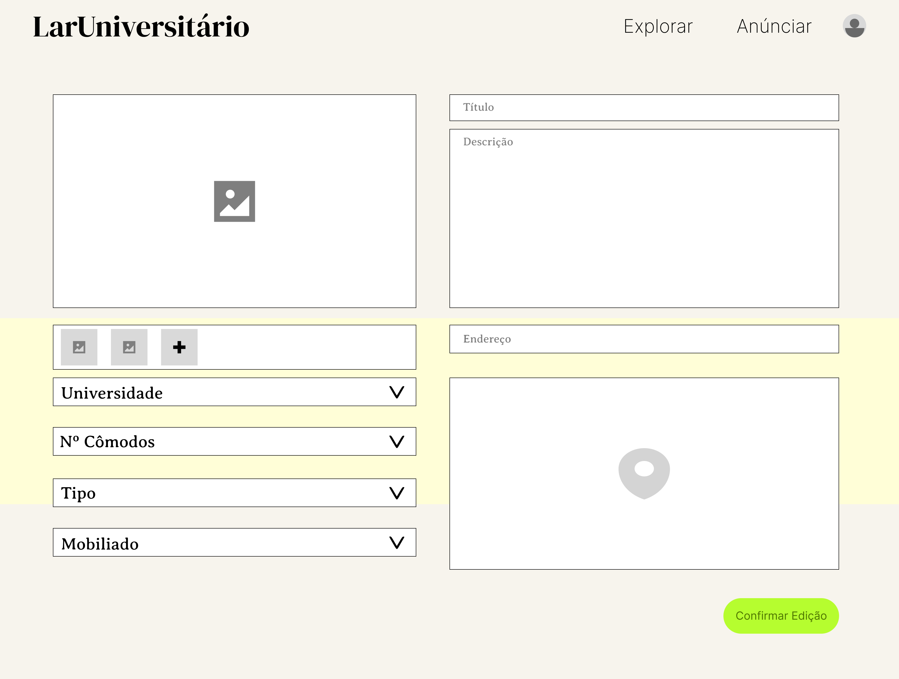

### My Ad List Page

 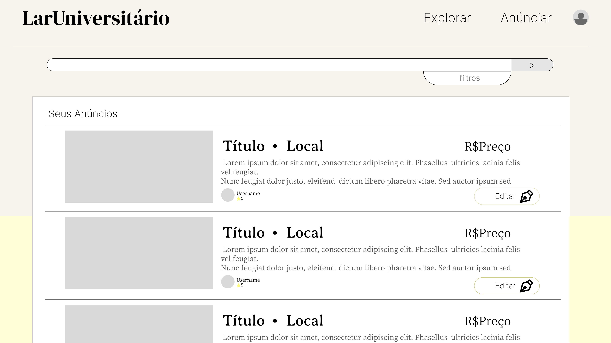

 ### My Ratings

 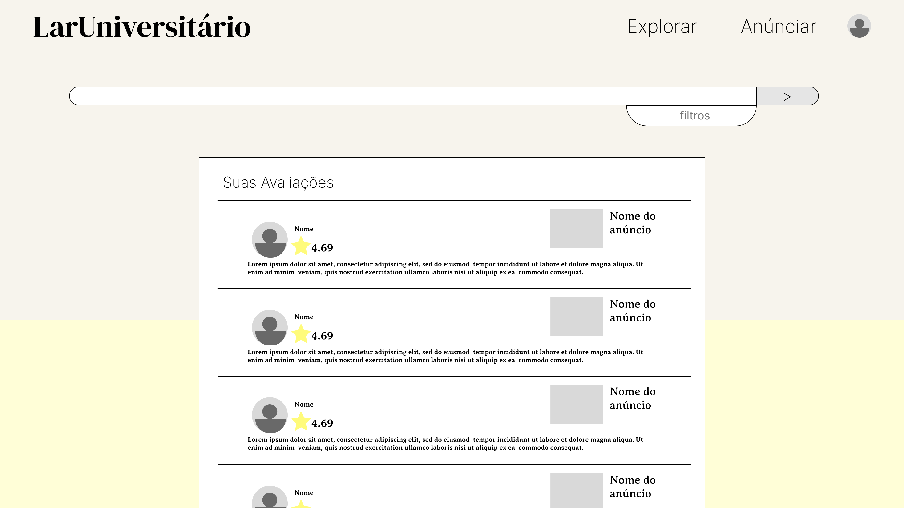

